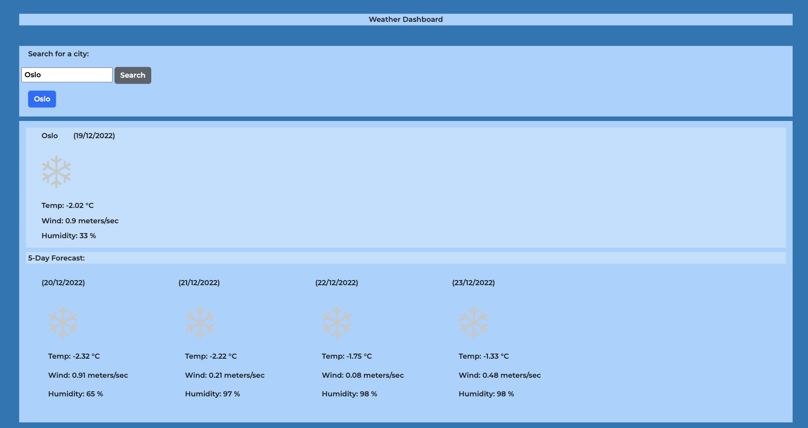

## Weather Forecast

## Description

The purpose of this project was to try and use the openweather api in order to pull data from it, in order to display it to the final user. The motivation behind this project was to develop my skills of using apis and how they can be manipulated specifically their urls and in general to improve my way of thinking with javascript. The specific problems that it solves are for example: pulling an api and being able to accurately navigate it, through finding the lat and long of a city given by name and then storing these values and pasting it to a second url, thus using 2 fetches. I learnt the basics of apis and how they can be used and applied.

## Table of Contents

- [Installation](#installation)
- [Usage](#usage)
- [Credits](#credits)

## Usage

If you wish to use the website go ahead and clone the repo and open in the index.html file or you can directly click on this URL: https://venbak.github.io/WeatherForecast/ 

Here is what the website should look like:

## Credits

I would like to credit the API :https://openweathermap.org/

Other URLs:
https://stackoverflow.com/questions/12595815/push-user-input-to-array 

Icons:
https://support.apple.com/fr-fr/guide/iphone/iph4305794fb/ios  
